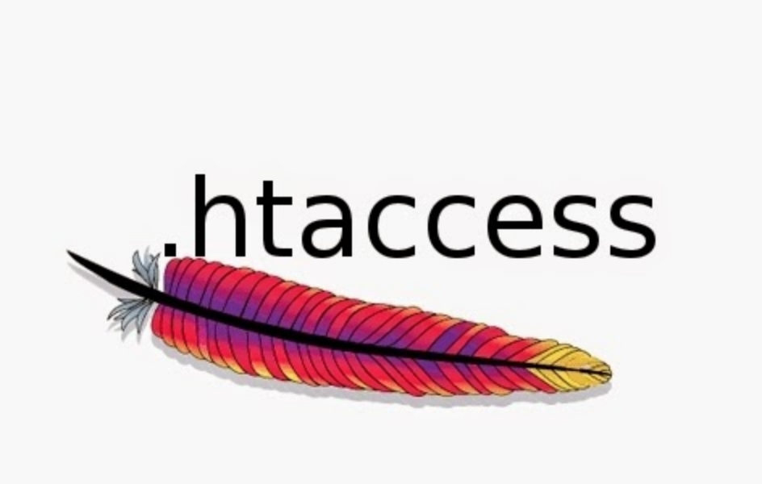

## Estudio de directivas para ficheros htaccess entre otros usados en apache server 
----------------------------------------------------------------------------------

 

----------------------------------------------------------------------------------
#### Referencias 

- [Carlos Alfaro](https://www.youtube.com/watch?v=y9KEgh6yXME&list=PLH_tVOsiVGzkGD2sB-cmSkxKzvoMYZrHL)

- [norfipc](https://norfipc.com/codigos/como-usar-htaccess-apache-trucos-ejemplos-practicos.php)

- [desarrollowp](https://desarrollowp.com/blog/tutoriales/creando-el-htaccess-perfecto-para-wordpress/)

- [ticarte](https://www.ticarte.com/contenido/como-configurar-el-fichero-htaccess)

- [incibe-cert](https://www.incibe-cert.es/blog/sec-joomla)

- [ayudawp](https://ayudawp.com/todo-sobre-htaccess/)

- [semicolonworld](https://www.semicolonworld.com/question/24730/htaccess-protect-download-private-files-from-user-39-s-directory-using-php)

- [wikipedia](https://en.wikipedia.org/wiki/List_of_Apache_modules)

- [jonmircha repositorio GitHub](https://github.com/jonmircha/kiss-php)

- [php_mvc_starter fork ricardoalcocer](https://github.com/codefuncode/php_mvc_starter)